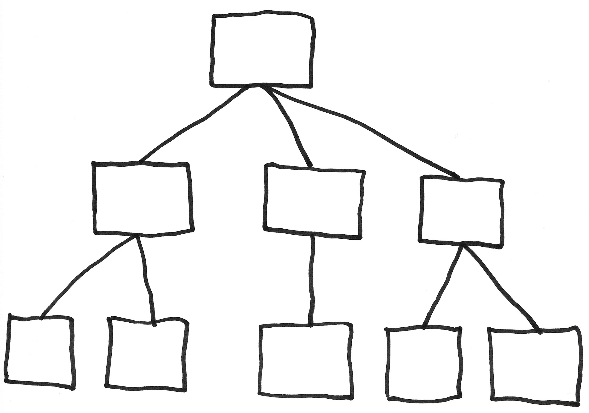

# hierarchiclass

## Overview

This project consists of a hierarchical text classification task. 



## Requirements
Python 3.6

## Usage

First, make sure your requirements are installed and your env variables set:
```
cd hierarchiclass
export PYTHONPATH="."
export LC_ALL=C.UTF-8
export LANG=C.UTF-8
pip install -r requirements.txt
```

To predict a model using the single model approach:
```
python codebase/predict.py --sentence <SENTENCE> --save-folder models/out/ --model-name balanced
```


To predict a model using the multi model approach, you also need to download the relevant data:
```
python codebase/download_data.py  --mode prediction_models_multi
python codebase/predict.py --sentence <SENTENCE> --save-folder models/out/multimodel --multimodel True
```

To train a model:
```
python codebase/download_data.py  --mode train_data_single
python codebase/train.py --input-csv data/training_balanced.csv --save-folder <SAVE_FOLDER> --model-name <MODEL_NAME>
```
Attention: The input csv used in training was NOT the complete data. It was the result from the data split between training and test set plus undersampling to have a more well balanced dataset. 


To run evaluation for the single model approach on the test set:
```
python codebase/model/final_assessment.py --test-set data/test.csv --save-folder models/out/ --model-name balanced
```

To run evaluation for the multi model approach on the test set:
```
python codebase/download_data.py  --mode prediction_models_multi
python codebase/model/final_assessment.py --test-set data/test.csv --save-folder models/out/multimodel   --multimodel True
```

To run pytest:
```
pytest
```

## Report

### Exploring the dataset 

To see details about the data analysis carried out on the data and the chosen approach, check the first notebook in the notebooks directory ("1 - Analyse data.ipynb")

### Model selection

I decided to use [XLNet](https://arxiv.org/pdf/1906.08237.pdf) as my model architecture.

Some of the reasons that made me go with XLNet:

- XLNet is still the state of the art for text classification in many datasets (e.g. the AG News corpus, the DBpedia dataset and 	
IMDb), so I knew it would yield good results.
- The data provided for this project is similar to dbpedia data, which XLNet achieves the state of the art, so I had reason to believe that this would be a good choice.
- On a personal note, I had not explored with XLNet in practice before, so I was curious to try.

If I had more time, I would try to:

- Collect more data for the classes that did not have a lot of samples.
- Optimize the parameters in XLNet a bit more.
- Try a different architecture altogether.

### Results


I tried a single model approach and a multi model approach to solve this problem. My initial hypothesis was that the multi model approach would perform better, although slower. However, as the table below shows, the single model approach with balance adjustments for the data performed slightly better. I believe this was at least partially due to error from multiple models getting accumulated. I report the results based on classification of the label in the third level using the weighted average of the metrics (see more details in the final_assessment.txt file both in /models/out/multimodel/ and in /models/out/balanced)

| Approach | Precision | Recall | F1-score | 
| --- | --- | --- | --- |
| single model | 0.95 | 0.94 |  0.94 |
| multi model | 0.94 | 0.93 |  0.93 |


